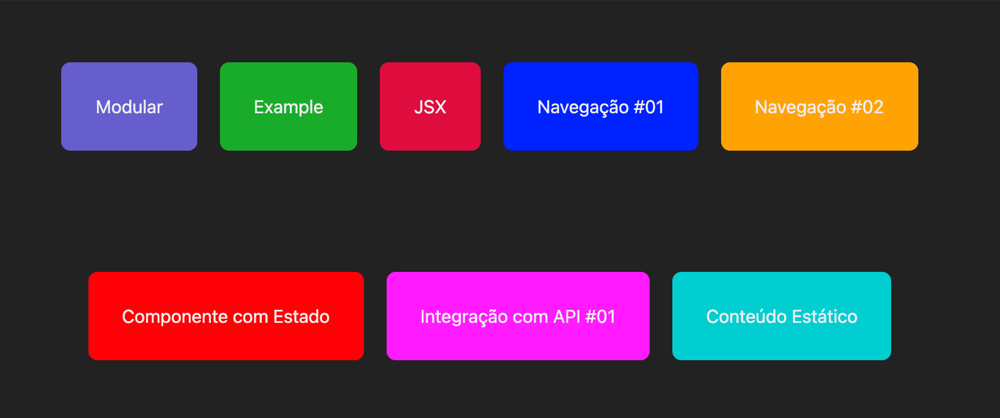

### 📚 Sobre

Esse módulo é sobre os fundamentos e a prática em ReactJs/ NextJs em relação:
-  ao estilo(CSS) global e modularizado;
-  a criação de componentes; 
-  a integração do JSX com o JS
-  a navegação entre os componentes de forma simples e dinâmica;
-  a criação de componente com estado;
-  a integração com API;
-  e a criação de um conteúdo estático.


<div align="center">
    
    <p>Este é um projeto Next.js inicializado com create-next-app.</p>
</div>

### ⏱ Começando

Primeiro, clone o repositório:
```bash
#https://github.com/polyanetuag/fundamentos)

# Instale as dependências
$ npm install

# Execute o servidor de desenvolvimento:
$ npm run dev 

```

Depois, abra http: //localhost:3000 com seu navegador para ver o resultado.
###  🚀 Tecnologias utilizadas

- ReactJs
- NextJs

###  📋 Licença
Esse projeto está sob a licença MIT.

---
Desenvolvido com 💜 por Polyane Tuag